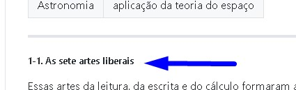

# Guia de Produção do Ebook online
## Passos iniciais
- Alterar extensão do livro epub em zip
- Extrair arquivo compactado para uma pasta
- Navegar para a pasta onde se encontra o texto do Livro.
  - No caso do Trivium, pasta 'OEBPS'
- O arquivo 'part0009.xhtml', o capitulo 1, será aberto como estudo de caso deste guia.

## Converter de HTML para Markdown
- Com o arquivo xhtml aberto num nagevegador web, abra seu código fonte digitando 'Ctrl+U'
- Tendo o código fonte exibido em tela, selecione todo seu conteúdo com 'Ctrl+A' e copie o texto com 'Ctrl+C'
- O texto deverá ser processado por um conversor de HTML para Markdown. Como exemplo, será utilizado o site [convertsimple](https://www.convertsimple.com/convert-html-to-markdown/)

### Utilização do site convertsimple
- Cole o código HTML no campo 'Input'
- Observe o texto markdown que automaticamente aparecerá no campo 'output'
- No campo 'Output', clique no botão 'Copy to Clipboard', que terá o mesmo efeito que selecionar todo o texto markdown e digitar 'Ctrl+C'.

### Fase editorial
- Usando um processador de texto preferencialmente com suporte à renderização de arquivos markdown, cole o texto markdown gerado. Recomenda-se utilizar o software VSCode habilitado com extensão 'Markdown All in One'.
- A formatação deverá ser completamente revista, seguindo um padrão de estilos.
- No caso do Trivium, é seguido um guia de estilos.

#### Guia de Estilos

Modelo
```
##### Descricao do estilo
\
Estilo:\
`## {texto}`

Exemplo em livro:\
\
Figura x

Escrita em markdown:
\```
## xxxxxxxxxxxxxxxx
\```

Formatado via markdown:\
\
Figura x
```

##### Titulo de inicio de capitulo
\
Estilo:\
`## {texto}`

Exemplo em livro:\
\
Figura 1

Escrita em markdown:
```
## 1. AS ARTES LIBERAIS
```

Formatado via markdown:\
\
Figura 2

##### Titulo grande em maiusculo
\
Estilo:\
`### {texto}`

Exemplo em livro:\
\
Figura 3

Escrita em markdown:
```
### AS ARTES LIBERAIS
```

Formatado via markdown:\
\
Figura 4

##### Titulo grande capitulado
\
Estilo:\
`#### {texto}`

Exemplo em livro:\
\
Figura 5

Escrita em markdown:
```
#### O trivium e o quadrivium
```

Formatado via markdown:\
\
Figura 6

##### Titulo pequeno capitulado negrito
\
Estilo:\
5#\
`##### {texto}`

Exemplo em livro:\
\
Figura 7

Escrita em markdown:
```
##### O trivium: As três artes da linguagem pertinentes à mente
```

Formatado via markdown:\
\
Figura 8


##### Titulo numerado. 1-1, 1-2...
\
Estilo:\
5#\
`##### {texto}`

Exemplo em livro:\
\
Figura 9

Escrita em markdown:
```
##### 1-1. As sete artes liberais
```

Formatado via markdown:\
\
Figura 10


##### Titulo pequeno maiusculo
\
Estilo:\
5#\
`##### {texto}`

Exemplo em livro:\
\
Figura 13

Escrita em markdown:
```
##### SÍMBOLOS: ESPECIAIS OU COMUNS
```

Formatado via markdown:\
\
Figura x


##### Titulo pequeno capitulado
\
Estilo:\
6#\
`###### {texto}`

Exemplo em livro:\
\
Figura 15

Escrita em markdown:
```
###### O som e a dimensão psicológica
```

Formatado via markdown:\
\
Figura x

##### Bloco com tag ilustracao
\
Estilo:
```
---
> {titulo}

---
```

Exemplo em livro:\
\
Figura 17

Escrita em markdown:
```
---

> ILUSTRAÇÃO: Relação entre a metafísica e as artes da linguagem

{texto}
---
```

Formatado via markdown:\
\
Figura 18


##### Tabelas
\
Estilo:
```
| titulo1 | titulo2 |
| ------- | ------- |
| texto1  | texto2  |
| texto3  | texto4  |
```

Exemplo em livro:\
\
Figura 19

Escrita em markdown:
```
|           |                                      |
| --------- | ------------------------------------ |
| Lógica    | arte de pensar                       |
| Gramática | arte de inventar e combinar símbolos |
| Retórica  | arte de comunicar                    |

```

Formatado via markdown:\
\
Figura 20

